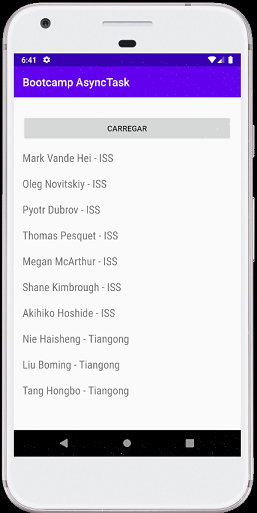

# Astronautas no espaço :space_invader:

App para Android que recupera dados de uma API e exibe os nomes de
astronautas que estão nesse momento em alguma nave no espaço orbitando a
Terra.

Aplica modelos de Threads no Android exemplificado com a implementação
de AsyncTask.

#### Screenshot

